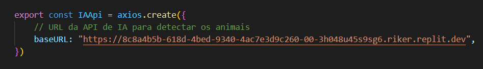

## Integrantes do Grupo OceanDex
> ##### Carlos Alberto Macharelli Júnior - RM551677
> ##### Carlos Eduardo Mendonça da Silva - RM552164
> ##### Eduardo Toshio Rocha Okubo - RM551763
> ##### Kauê Alexandre de Oliveira - RM551812
> ##### Vitor Machado Miranda - RM551451
---
---
### LINK REPOSITÓRIO: https://github.com/Duh0127/GS01-Mobile
### LINK BACKEND NODEJS: https://replit.com/@rodatupmocgamer/OceanDex?v=1
### LINK BACKEND IA: https://replit.com/@rodatupmocgamer/ApiFlaskAPI?v=1
### CREDENCIAIS DE ACESSO AO PERFIL TESTE
> ##### Email: fiap@email.com
> ##### Senha: fiap24
---
---

# NOSSO PROTÓTIPO POSSUI SUPORTE PARA DETECTAR APENAS OS SEGUINTES ANIMAIS MARINHOS:
> ##### - Arraia-Jamanta
> ##### - Baleia-Jubarte
> ##### - Boto-Cor-de-Rosa
> ##### - Camarão-Rosa
> ##### - Caranguejo-Azul
> ##### - Cavalo-Marinho
> ##### - Coral-Cérebro
> ##### - Estrela-do-Mar
> ##### - Golfinho-Rotador
> ##### - Lagosta
> ##### - Tartaruga-Verde
> ##### - Tubarão-Martelo
> ##### - Raia-Manta
> ##### - Polvo
> ##### - Peixe-Palhaço

---
---
# Sumário para Utilização do Backend NodeJs e Backend de IA

## Índice
1. [Introdução](#introdução)
2. [Utilização do Backend NodeJs](#utilização-do-backend-nodejs)
   1. [Acessar o Link do Replit](#acessar-o-link-do-replit)
   2. [Fazer um Fork para Sua Conta Pessoal](#fazer-um-fork-para-sua-conta-pessoal)
   3. [Clicar em RUN](#clicar-em-run)
   4. [Substituir a URL no Arquivo API.js](#substituir-a-url-no-arquivo-apijs)
      1. [Obter a URL na Aba Webview do Replit](#obter-a-url-na-aba-webview-do-replit)
3. [Utilização do Backend de IA](#utilização-do-backend-de-ia)
   1. [Repetir os Passos do Backend NodeJs](#repetir-os-passos-do-backend-nodejs)
   2. [Trocar a IAApi pela URL da Aba Webview no Replit](#trocar-a-iaapi-pela-url-da-aba-webview-no-replit)

## Introdução
Este guia fornece as instruções necessárias para utilizar os backends NodeJs e de IA para o projeto OceanDex. Siga as etapas para configurar e executar ambos os backends.

## Utilização do Backend NodeJs
### Acessar o Link do Replit
- Clique no [link do Replit](https://replit.com/@rodatupmocgamer/OceanDex?v=1) fornecido.

### Fazer um Fork para Sua Conta Pessoal
- Após acessar o Replit, faça um FORK do projeto para sua conta pessoal no Replit.

### Clicar em RUN
- No ambiente do Replit, clique no botão "RUN" para iniciar o backend.

### Substituir a URL no Arquivo API.js
- Localize o arquivo `API.js` no seu projeto.

#### Obter a URL na Aba Webview do Replit
- Copie a URL que aparece na aba WEBVIEW no Replit e substitua a URL no arquivo `API.js` com esta nova URL.

---

## Utilização do Backend de IA
### Acessar o Link do Replit
- Clique no [link do Replit de IA](https://replit.com/@rodatupmocgamer/ApiFlaskAPI?v=1) fornecido.
### Repetir os Passos do Backend NodeJs
- Siga os mesmos passos mencionados na seção "Utilização do Backend NodeJs" para configurar o backend de IA.

### Trocar a IAApi pela URL da Aba Webview no Replit
- Após obter a URL na aba WEBVIEW do Replit, substitua a `IAApi` pela URL copiada.

---

Seguindo estas instruções, você conseguirá configurar e executar tanto o backend NodeJs quanto o backend de IA para o projeto OceanDex.

