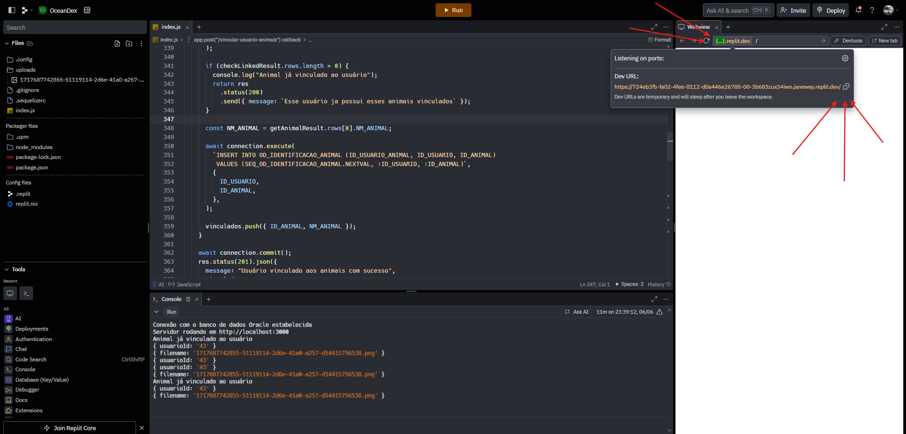
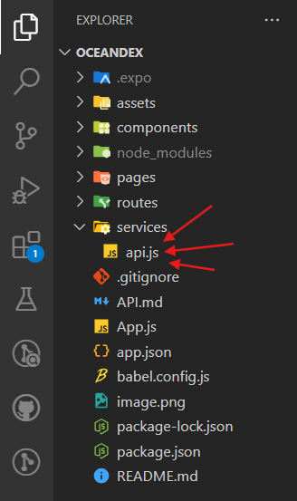
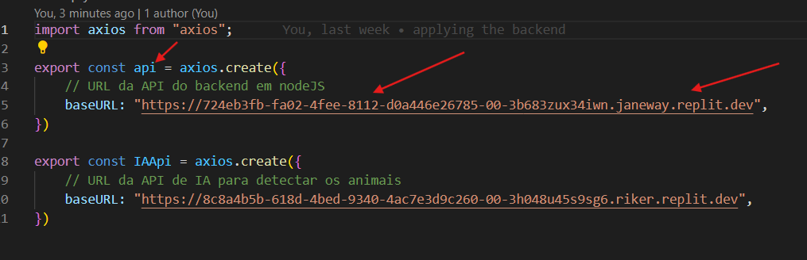

## Integrantes do Grupo OceanDex
> ##### Carlos Alberto Macharelli Júnior - RM551677
> ##### Carlos Eduardo Mendonça da Silva - RM552164
> ##### Eduardo Toshio Rocha Okubo - RM551763
> ##### Kauê Alexandre de Oliveira - RM551812
> ##### Vitor Machado Miranda - RM551451
---
---
### LINK REPOSITÓRIO: https://github.com/Duh0127/GS01-Mobile
### LINK BACKEND NO REPLIT: https://replit.com/@rodatupmocgamer/OceanDex?v=1
### CREDENCIAIS DE ACESSO AO PERFIL TESTE
> ##### Email: fiap@email.com
> ##### Senha: fiap24
---
---
## Como utilizar o backend
> ##### - Acessar o link do replit
> ##### - Dar um FORK para sua conta pessoal
> ##### - Clicar em RUN
> ##### - Após isso, substituir a url no arquivo API.js
> ##### - A url deve ser a mesma que aparece no na aba WEBVIEW no replit

